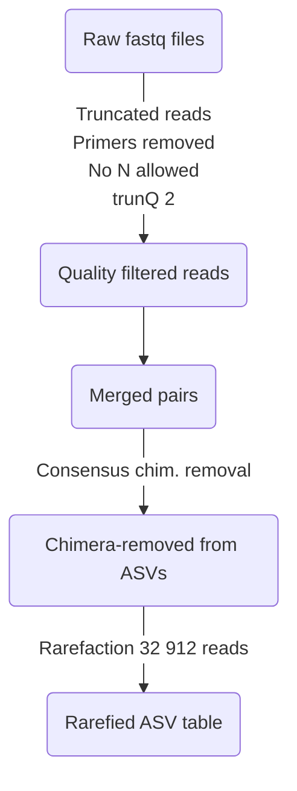
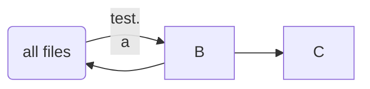

# Response of *Lonicera maackii* to soil chemistry and fungal communities. 

This project aims at disentangling the relative contribution of soil physico-chemistry and fungal communities in driving *Lonicera maackii* performance. In 2019, we sampled 50 soil inocula, from 5 distinct sites, and grew *Lonicera maackii* in these inocula in a growth chamber, for 12 weeks. 

We measured shoot dry mass, root length and average diameter, and root fungal colonization as response variables.

In parallel, for each inoculum, we measured soil physico-chemistry and extract DNA to characterize fungal community structure using Illumina MiSeq technology (PE250bp), with amplicons targeting the ITS1 region. Data are provided as follows:

1. Soil properties are included in the file ``XYZ.XYZ``

2. Soil fungal community structure can be found in the file ``XYZ.txt``, where rows are inocula and number within each cell are the number of reads found in each inoculum for the corresponding column (fungal sequence variant). We also provide raw sequence files within the sequence read archives (SRA) under the BioProject # XYZ. The SRR numbers associated with all samples can be found in our file ``SRRs.txt``.

3. *Lonicera* growth can be found in the file ``XYZ.XYZ``

 

*EXPLAIN ALL METADATA FOR THE RESPECTIVE FILES. E.g., explain the protocol used for each soil property, the way each Lonicera growth response variable was measured, and the protocol for the sequencing...*

 
 

## Soil properties : ``XYZ.XYZ``

[.................]

 
 

## Soil fungal communities : ``XYZ.txt``

[.................]

 
 

## *Lonicera* growth response : ``XYZ.XYZ``

[.................]

 
 

Below, we outline data analyses allowing us to link soil properties and fungal communities to *Lonicera* performance, while taking into account site identity.

 
 

## Bioinformatics

Before proceeding with statistical analyses, we first processed raw ``.fastq`` sequence files using the R package ``dada2``. This was done using the [following script](./Scripts/Script_ITS%20Calcul%20Canada%20Coralie.R).    
Afterwards, we cleaned the output file `OutputITS.RData`, by removing unused objects from the environment, and sequencing samples belonging to another project, using the [following script](./Scripts/Script%20Coralie%20ITS%202023-09-14.R). We thus ended up with the `.RData` object ``Coralie ITS.RData``, available [here](./Coralie%20ITS.RData). This object contains :

1. A metacommunity (``comm``) with communities (i.e., samples, as rows) and fungi as columns. All sites with less than 5k reads are removed, and the remaining are rarefied at 32 912 reads. 
2. A taxonomy (``taxa``) for the kept fungi, according to the match (naive Bayesian classifier) with UNITE [version = 9.0].

 
Briefly, the pipeline can be summed up as:

 

another test

##

